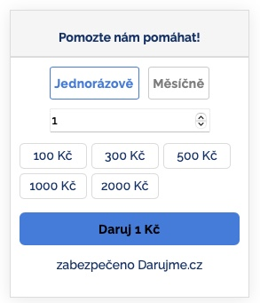

# Darujme.cz widget for react applications

This widget is inspired by the https://www.darujme.cz/ official widget. It is a simple react component that can be used in any react application.



## Usage

    ```javascript
    import Darujme from 'Darujme';

    <Darujme currency={"CZK"} projectId={123} />
    ```


Feel free to use this widget in your projects. If you find any issues or have any ideas for improvements,
feel free to create an issue or a pull request.